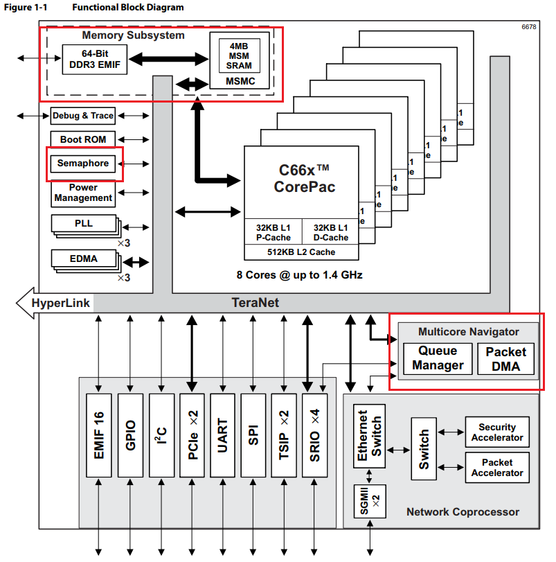

## 官方模拟器
+ CCS3.3中无C6678模拟器
+ CCS5.5中有C6678模拟器
+ CCS6以上是没有模拟器的，神软例程中debug设置是仿真器。

    

## 模拟器中所需模块
1. 与C64x+相似的模块
    1. DSP核（两层cache，指令集兼容C67和C64x+，比C64x+多90个新指令)
    2. 外设
        1. SRIO
        2. PCIe Gen2
        3. HyperLink
        4. GbE Switch Subsystem
        5. 64-Bit DDR3 Interface
        6. EMIF
        7. TSIP（Telecom Serial Ports）
        8. UART
        9. GPIO
        10. SPI Interface
        11. Semaphore Module
        12. 64-Bit Timer
        13. On-Chip PLLs

    
    

2. 需要关注的模块
    1. MSMC（多核共享存储控制器，Multicore Shared Memory Controller）
        1. 4096KB的共享SRAM（作为共享L2或L3）
        2. 内存保护单元（Memory Protection Unit），对于 MSM SRAM 和 DDR3_EMIF
        + MSMC Register Access Control
        + 使用DDR实现同步，则需要处理cache一致性问题，不知道MSM作为乒乓缓存是否需要。

        

    2. 多核导航器（Multicore Navigator）
        1. 8192多功能硬件队列和队列管理器
        2. PKTDMA（Packet-Based，无Overhead）
            + QMSS中多个queue对应一个PKTDMA queue。

        

        3. 通过PKTDMA中断实现核间通信

        

        4. 编程：
            1. 通过寄存器级代码
            2. 通过CPPI LLD（low-level drivers） API。
    3. 硬件信号量（64个）

        

    4. TeraNet（内部总线交换网络（矩阵））
    5. 网络协处理器
3. 重要指令
    1. MFENCE

## 可能的核间通信方法
1. 同步
    1. IPC Generation/Acknowledgement Registers 产生IPC功能的中断。
    2. 利用硬件信号量模块实现同步，也是通过中断同步。
2. 消息
    1. 利用多核导航器中DMA实现IPC，也是通过中断同步。
    2. 直接读写MSM那4MB实现共享，估计是最快的（不知道需不需要处理cache一致）。
3. 数据传输
    1. 利用多核导航器中DMA实现IPC，也是通过中断同步。

## 并行程序
1. 种类
    1. 程序驱动
    2. 数据驱动
2. 编写方法
    1. 寄存器级别编程
    2. XDCTools -> SYS/BIOS -> IPC等库
    + 需要安装
        1. processor sdk
        2. pdk_c6678
        3. mcsdk（与上面可能是重复的）
        4. ipc
    + 注意事项
        1. 选择bios_6_35_04_50，bios_6_76_03_01没有platform
        2. \bios_6_35_04_50\packages\ti 下没有 posix 包文件夹，需要从bios_6_76_03_01复制过去。
        3. 神软提供的例程，八个核应该从大到小启动。
        4. debug配置中，对C6678中每个C66x核都要载入程序，如下图红框后的下拉列表。
        
        
        

